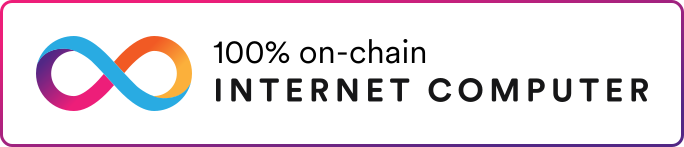

# AdanfoCash - Decentralized Student Loan Platform

<div align="center">
  
  <p>Empowering Education Through Decentralized Finance</p>
</div>

## Overview

AdanfoCash is a revolutionary decentralized student loan platform built on the Internet Computer Protocol (ICP). Our mission is to make education financing accessible, transparent, and efficient through blockchain technology. By connecting students with lenders in a trustless environment, we're democratizing access to education while ensuring fair returns for investors.

## Key Features

### For Students
- **Zero-Knowledge Student Verification**
  - Secure verification of student status without exposing personal data
  - Integration with university databases through ZKPass protocol
  - Automated eligibility checks and verification renewal

- **Smart Loan Management**
  - Flexible loan terms based on academic performance
  - Automated repayment scheduling
  - Early repayment incentives
  - Real-time loan status tracking

- **Dynamic Credit Scoring**
  - Initial credit score of 650 for all verified students
  - Performance-based score adjustments
  - Academic achievement bonuses
  - Repayment history tracking

### For Lenders
- **Investment Dashboard**
  - Real-time portfolio overview
  - Risk assessment metrics
  - Automated interest calculations
  - Investment diversification tools

- **Smart Contract Security**
  - Automated loan disbursement
  - Secure fund management
  - Transparent transaction history
  - Collateral-free lending with institutional backing

### Platform Features
- **Educational Resources**
  - Financial literacy courses
  - Blockchain technology tutorials
  - Investment strategy guides
  - Community forums and support

- **Blockchain Integration**
  - Fully decentralized operations
  - Transparent transaction records
  - Smart contract automation
  - Cross-chain compatibility (planned)

## Technical Architecture

### Frontend Stack
- **Framework**: React 18 with TypeScript
- **Build Tool**: Vite
- **UI Components**: shadcn/ui
- **Styling**: Tailwind CSS
- **State Management**: React Context + Custom Hooks
- **Authentication**: Internet Identity

### Backend Stack
- **Runtime**: Internet Computer
- **Language**: Motoko
- **Storage**: Orthogonal Persistence
- **Authentication**: Principal IDs
- **Smart Contracts**: Canister-based

### Security Features
- Zero-knowledge proofs for student verification
- End-to-end encryption for sensitive data
- Multi-signature wallet support
- Regular security audits
- Automated threat detection

## Getting Started

### Prerequisites
```bash
# Required software versions
Node.js >= 18.0.0
DFX >= 0.15.0
PNPM >= 8.0.0
```

### Development Setup
1. **Clone and Install**
   ```bash
   git clone https://github.com/dr-winner/adanfocash.git
   cd adanfocash
   pnpm install
   ```

2. **Environment Configuration**
   ```bash
   # Create .env file
   cp .env.example .env
   
   # Configure your environment variables
   VITE_BACKEND_CANISTER_ID=your_canister_id
   VITE_DFX_NETWORK=local
   ```

3. **Start Development Environment**
   ```bash
   # Terminal 1: Start IC replica
   dfx start --clean
   
   # Terminal 2: Deploy canisters
   dfx deploy
   
   # Terminal 3: Start frontend
   cd src/AdanfoCash_frontend
   pnpm dev
   ```

### Production Deployment
1. **Build Production Assets**
   ```bash
   pnpm build
   ```

2. **Deploy to IC Network**
   ```bash
   dfx deploy --network ic
   ```

## Testing

```bash
# Run unit tests
pnpm test

# Run integration tests
pnpm test:integration

# Run e2e tests
pnpm test:e2e
```

## Project Structure
```
adanfocash/
├── src/
│   ├── AdanfoCash_backend/    # Motoko backend code
│   │   ├── main.mo            # Main canister code
│   │   └── types.mo           # Type definitions
│   │
│   └── AdanfoCash_frontend/   # React frontend code
│       ├── src/
│       │   ├── components/    # UI components
│       │   ├── services/      # Backend services
│       │   ├── hooks/         # Custom React hooks
│       │   └── pages/         # Page components
│       │
│       └── public/            # Static assets
│
├── dfx.json                   # DFX configuration
└── package.json              # Project dependencies
```

## Contributing

We welcome contributions! Please see our [Contributing Guidelines](CONTRIBUTING.md) for details on how to submit pull requests, report issues, and contribute to development.

### Development Workflow
1. Fork the repository
2. Create a feature branch
3. Commit your changes
4. Push to your fork
5. Submit a pull request

## License

This project is licensed under the MIT License - see the [LICENSE](LICENSE) file for details.

## Team

- **Dr. Winner** - Lead Developer & Project Manager
  - Email: duvorrichardwinner@gmail.com
  - GitHub: [@dr-winner](https://github.com/dr-winner)

## Acknowledgments

- Internet Computer Foundation for infrastructure support
- DFinity for technical guidance
- Our early adopters and testing partners

## Support

For support, please:
1. Check our [Documentation](docs/README.md)
2. Search existing [Issues](https://github.com/dr-winner/adanfocash/issues)
3. Create a new issue if needed
4. Join our [Discord Community](https://discord.gg/adanfocash)

Welcome to your new `AdanfoCash` project and to the Internet Computer development community. By default, creating a new project adds this README and some template files to your project directory. You can edit these template files to customize your project and to include your own code to speed up the development cycle.

To get started, you might want to explore the project directory structure and the default configuration file. Working with this project in your development environment will not affect any production deployment or identity tokens.

To learn more before you start working with `AdanfoCash`, see the following documentation available online:

- [Quick Start](https://internetcomputer.org/docs/current/developer-docs/setup/deploy-locally)
- [SDK Developer Tools](https://internetcomputer.org/docs/current/developer-docs/setup/install)
- [Motoko Programming Language Guide](https://internetcomputer.org/docs/current/motoko/main/motoko)
- [Motoko Language Quick Reference](https://internetcomputer.org/docs/current/motoko/main/language-manual)

If you want to start working on your project right away, you might want to try the following commands:

```bash
cd AdanfoCash/
dfx help
dfx canister --help
```

## Running the project locally

If you want to test your project locally, you can use the following commands:

```bash
# Starts the replica, running in the background
dfx start --background

# Deploys your canisters to the replica and generates your candid interface
dfx deploy
```

Once the job completes, your application will be available at `http://localhost:4943?canisterId={asset_canister_id}`.

If you have made changes to your backend canister, you can generate a new candid interface with

```bash
npm run generate
```

at any time. This is recommended before starting the frontend development server, and will be run automatically any time you run `dfx deploy`.

If you are making frontend changes, you can start a development server with

```bash
npm start
```

Which will start a server at `http://localhost:8080`, proxying API requests to the replica at port 4943.

### Note on frontend environment variables

If you are hosting frontend code somewhere without using DFX, you may need to make one of the following adjustments to ensure your project does not fetch the root key in production:

- set`DFX_NETWORK` to `ic` if you are using Webpack
- use your own preferred method to replace `process.env.DFX_NETWORK` in the autogenerated declarations
  - Setting `canisters -> {asset_canister_id} -> declarations -> env_override to a string` in `dfx.json` will replace `process.env.DFX_NETWORK` with the string in the autogenerated declarations
- Write your own `createActor` constructor
